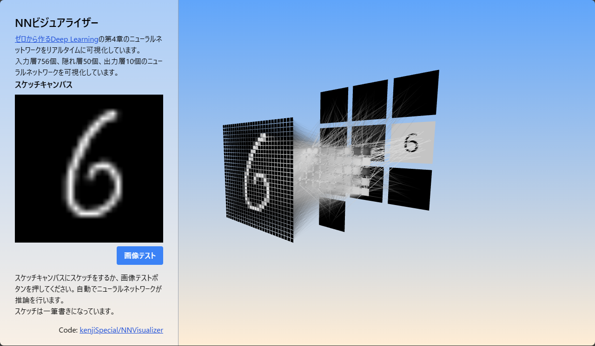

# NNビジュアライザー

[](https://ks-nnvisualizer.netlify.app/)
URL: https://ks-nnvisualizer.netlify.app/

## 概要

NNビジュアライザーは、[「ゼロから作るDeep Learning」](https://www.amazon.co.jp/dp/4873117585?ref_=cm_sw_r_cp_ud_dp_D4WTQD6YZC7XPRNG5K9V) で学んだニューラルネットワークのモデル学習で得られたパラメータを視覚化するツールです。

入力層756個、隠れ層50個、出力層10個のニューラルネットワークを可視化しています。スケッチキャンパスに自分で絵を描いてみると、文字を認識してくれます。

このプロジェクトは、TypeScript、React、およびReact Three Fiber（r3f）を使用して開発されています。ニューラルネットワークの複雑な構造とそのパラメータを直感的に理解するのに役立ちます。

# プレビュー

プロジェクトのプレビューはこちらからご覧いただけます: https://ks-nnvisualizer.netlify.app/

## 開発とビルド

### プロジェクトの開発

ローカルでの開発を行うには、以下のコマンドを実行します:

```
$ vite dev
```

このコマンドにより、開発用サーバが起動し、リアルタイムでのコード変更が反映されます。

### プロジェクトのビルド

プロジェクトをビルドして本番環境にデプロイするには、以下のコマンドを実行します:

```
vite build
```

このコマンドにより、本番用の最適化されたビルドが生成されます。

## コントリビュート

プロジェクトへの貢献に興味がある方は、issueやプルリクエストを通じてご参加ください。すべての貢献は大歓迎です！

## ライセンス

このプロジェクトはMITライセンスの下で公開されています。
